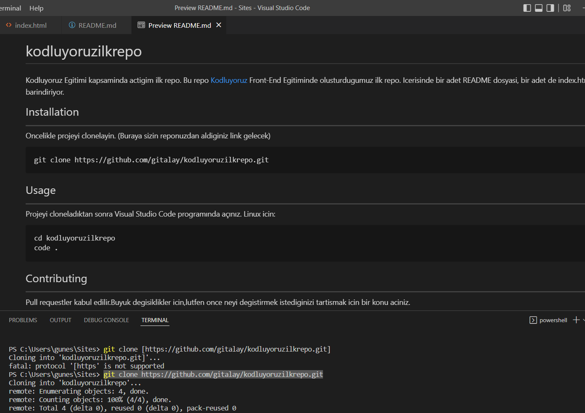

# kodluyoruzilkrepo
Kodluyoruz Egitimi kapsaminda actigim ilk repo.
Bu repo [Kodluyoruz](www.kodluyoruz.org) Front-End Egitiminde olusturdugumuz ilk repo. Icerisinde bir adet README dosyasi, bir adet de index.html barindiriyor.

## Installation 
---
Oncelikle projeyi clonelayin. (Buraya sizin reponuzdan aldiginiz link gelecek)
```
git clone https://github.com/gitalay/kodluyoruzilkrepo.git
```
## Usage
---
Projeyi cloneladıktan sonra Visual Studio Code programında açınız.
Linux icin:
```
cd kodluyoruzilkrepo
code .
```
## Contributing
---
Pull requestler kabul edilir.Buyuk degisiklikler icin,lutfen once neyi degistirmek istediginizi tartismak icin bir konu aciniz.
## Licence
---
[MIT](https://choosealicense.com/licenses/mit/)

